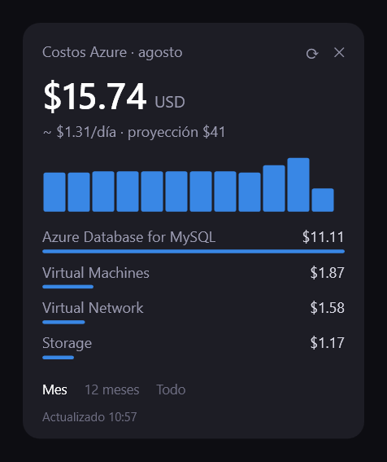

# Widget de costos Azure



Ventanita flotante para Windows que muestra los costos de tu suscripción de Azure, sin instalar nada: solo PowerShell (que ya viene en Windows) y Azure CLI.

Tres vistas (pestañas al pie, se recuerda la elegida):

- **Mes** — acumulado del mes: total, promedio diario, proyección a fin de mes y barras por día.
- **12 meses** — barras por mes del último año con promedio mensual.
- **Todo** — histórico completo (la API solo deja 12 meses por consulta, así que se junta por bloques anuales).

Cada vista trae su desglose por servicio, y con **clic derecho sobre cualquier barra** ves qué servicios se cobraron en ese periodo (el día en la vista Mes, el mes en las otras). La ventana se arrastra con el mouse, recuerda su posición, y se actualiza sola cada 4 horas (botón ⟳ para refrescar a mano).

## Requisitos

- Windows con PowerShell 5.1 (el que trae Windows 10/11).
- [Azure CLI](https://learn.microsoft.com/cli/azure/install-azure-cli) con sesión iniciada (`az login`) y permiso de lectura sobre la suscripción.

## Uso

```
wscript lanzar.vbs
```

Eso abre el widget sin ventana de consola. La primera consulta tarda un poco (la API de Cost Management limita peticiones seguido; el widget reintenta solo).

### Auto-arranque al iniciar sesión

Crea un acceso directo en la carpeta Inicio (`Win+R` → `shell:startup`) con destino:

```
wscript.exe "C:\ruta\al\repo\lanzar.vbs"
```

## Archivos

- `CostosAzureWidget.ps1` — todo el widget: UI en WPF y consultas a la API de Cost Management usando el token de tu sesión de `az`. **Guardado en UTF-8 con BOM** — si se pierde el BOM, PowerShell 5.1 lo lee como ANSI y los acentos salen rotos.
- `lanzar.vbs` — lanzador sin consola.
- `cache.json` (se genera solo) — últimos datos, posición de la ventana y vista elegida; permite pintar al instante al arrancar.

## Notas

- No guarda credenciales: usa el token que le da Azure CLI en el momento.
- Si aparece "Sin sesión de Azure", corre `az login` y refresca.
- Licencia [MIT](LICENSE).

---

Hecho por [BIGOLD](https://bigold.com.mx) 🥇
